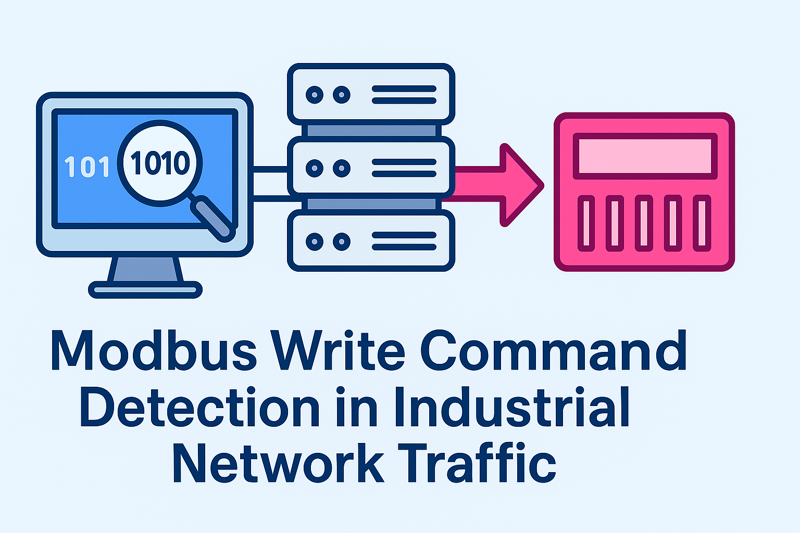
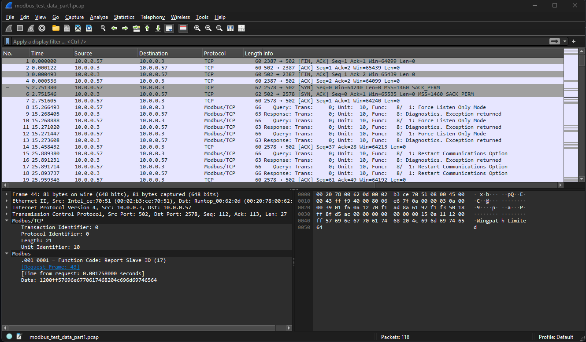
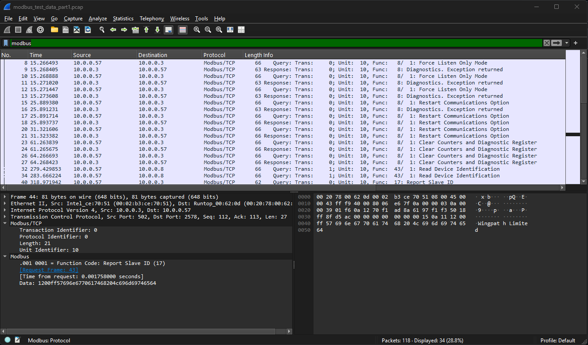

# Modbus Write Command Detection in Industrical Network Traffic

 

## Purpose

The purpose of this lab is to simulate a realistic OT (Operational Technology) incident detection scenario by analyzing Modbus/TCP network traffic for unauthorized Write Multiple Register (Function Code 16) commands. This exercise reinforces protocol-level understanding of Modbus, teaches how to filter and interpret packet captures in Wireshark, and highlights how unauthorized writes to PLC registers can result in unsafe or unexpected changes to industrial processes.

## Procedure

Download `pcap`	file from <a href="https://github.com/ITI/ICS-Security-Tools/blob/master/pcaps/ModbusTCP/modbus_test_data_part1.pcap">Tim Yardley's ICS-Security-Tools</a>

Open file in Wireshark

 

Add filter to only display modbus traffic

 

Analyze captures

## Discussion

## Planned Improvements 

