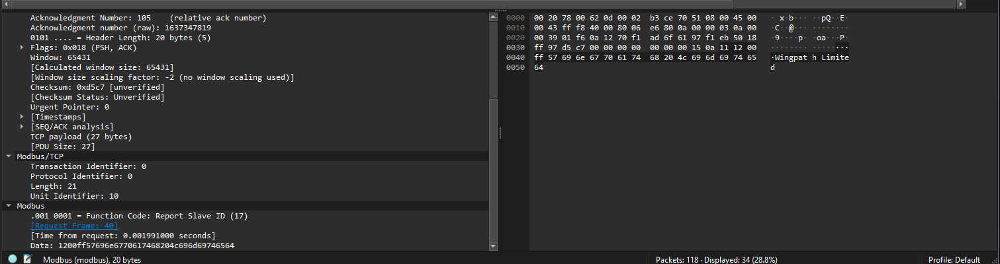

# Modbus Write Command Detection in Industrical Network Traffic

 

## Purpose

The purpose of this lab is to simulate a realistic OT (Operational Technology) incident detection scenario by analyzing Modbus/TCP network traffic for unauthorized Write Multiple Register (Function Code 16) commands. This exercise reinforces protocol-level understanding of Modbus, teaches how to filter and interpret packet captures in Wireshark, and highlights how unauthorized writes to PLC registers can result in unsafe or unexpected changes to industrial processes.

## Procedure

1. Download `pcap`	file from <a href="https://github.com/ITI/ICS-Security-Tools/blob/master/pcaps/ModbusTCP/modbus_test_data_part1.pcap">Tim Yardley's ICS-Security-Tools</a>

2. Open file in Wireshark

 

3. Add filter to only display modbus traffic

 

4. Analyze captures

 

 

 

 

 

 

## Discussion

The communication between devices is initiated from the IP Address 10.0.0.57 to 10.0.0.3. The user attempts to put the device in "Listen Only Mode" but the device target fails to respond. This failure in response could be due to the device already being in Listen Only Mode or being offline. The user performs the same attempt two more times and each time the device failed to respond. The user then attempts to restart the device but the device throws the same error and fails to respond. The user then attempts to restart the device, which is successful. They then restart the device another time, making it twice that the device has been restarted. The user then successfully runs a "Clear Counters and Diagnostic Register" command twice. 

Next, the user attempts to run a "Read Device Identification" command on a device with the IP Address of 10.0.0.8 but doesn't get a response. They then try again, but again, get no response from the target device.

The user then tries the "Report Slave ID" command on the device from earlier with the IP Address of 10.0.0.3 and gets a response of "Wingpath Limited". Activity from that IP Address ceases.

An IP Address of 10.0.0.9 then starts a connection with the target device 10.0.0.3. The user runs a "Read Coils" commandto retrieve the value for the 0th Coil, which is 0 (OFF). The command is then repeated to retrieve the value for the 2nd and 3rd coils, which are both also 0 (OFF).

The user runs a "Read Holding Registers" command to retrieve the values of two registers starting from register five which returns:
    - Register Number 5 (UINT16): 9
    - Register Number 6 (UINT16): 24

The user issues a "Write Single Coil" command to redundantly update the coil values that were previously read from 0 (OFF) to 0 (OFF).

Finally, the user issues a "Write Single Register" command to update the value of Register Number 5 from 9 to 11.
The communication is then disconnected.

Afterwards, the user connects to the device 10.0.0.8 from earlier that never responded with a "Read Device Identification" command. Data is sent back and forth from 10.0.0.57 to 10.0.0.8. 

## Planned Improvements

`Further investigate what's actually happening between 10.0.0.8 and 10.0.0.57 during the 3-way handshake` 

